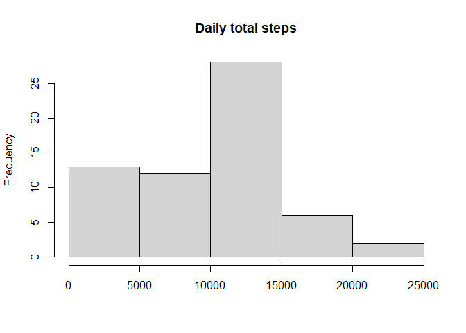
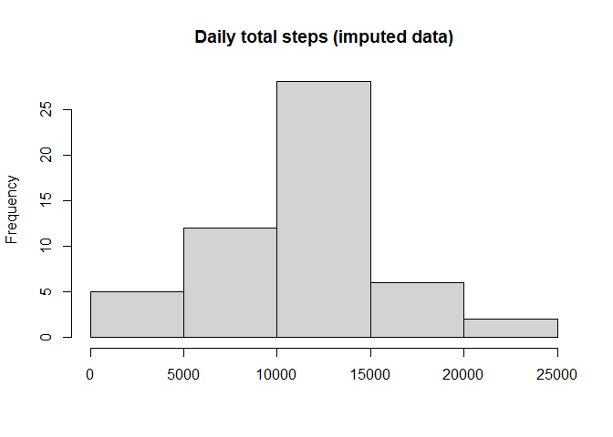
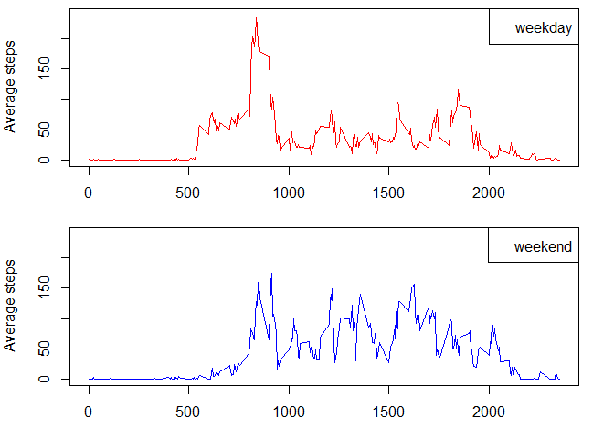

## Loading and preprocessing the data


```r
data <- read.csv("activity/activity.csv")
```

## What is mean total number of steps taken per day?

The following histogram shows the distribution of daily total steps.


```r
steps <- aggregate(data$steps, by = list(data$date), sum, na.rm = TRUE)

hist(steps$x, 
     main = "Daily total steps",
     xlab = "")
```

<!-- -->

```r
mean_steps <- mean(steps$x)
median_steps <- median(steps$x)
```
The mean is 9354.23 and the median is 10395 steps.


## What is the average daily activity pattern?

The following plot shows the average number of steps per 5-minute interval, averaged across all days.


```r
pattern <- aggregate(data$steps, by = list(data$interval), mean, na.rm = TRUE)

names(pattern)[1] <- "interval"
names(pattern)[2] <- "mean_steps"

plot(pattern$interval, 
     pattern$mean_steps, 
     type = "l",
     xlab = "Interval",
     ylab = "Average steps")
```

<!-- -->

```r
max_interval <- pattern[pattern$mean_steps == max(pattern$mean_steps), "interval"]
```
On average the interval 835 contains the maximum number of steps.


## Imputing missing values


```r
na_rows <- sum(!complete.cases(data))
```
The dataset contains 2304 rows with missing values.

The missing values will be replaced with the average number of daily steps for a given interval.


```r
data_imp <- tapply(data$steps, 
                   as.factor(data$date), 
                   \(x) replace(x, is.na(x), mean(x, na.rm = TRUE)),
                   simplify = TRUE)

steps_imp <- sapply(data_imp, sum)

hist(steps_imp)
```

<!-- -->

```r
mean_steps_imp <- mean(steps_imp, na.rm = TRUE)
median_steps_imp <- median(steps_imp, na.rm = TRUE)
```
The new mean is 1.076619\times 10^{4} and the new median is 1.0765\times 10^{4} steps. Compared to the original data the are almost identical now, which means the the resulting distribution is more evenly spread.

## Are there differences in activity patterns between weekdays and weekends?

The following panel-plot shows the activity on weekdays and weekends. It seems that on weekdays the activity is higher in the morning, but lower during the day. This could reflect office working days compared to more active weekends. Though on weekends the activity starts later.


```r
data$date <- as.Date(data$date)
data$weekdays <- weekdays(data$date, abbreviate = TRUE)
is_weekend <- data$weekdays %in% c("Sa", "So")

pattern_weekend <- aggregate(data$steps[is_weekend], by = list(data$interval[is_weekend]), mean, na.rm = TRUE)
pattern_weekday <- aggregate(data$steps[!is_weekend], by = list(data$interval[!is_weekend]), mean, na.rm = TRUE)

names(pattern_weekend)[1] <- "interval"
names(pattern_weekend)[2] <- "mean_steps"
names(pattern_weekday)[1] <- "interval"
names(pattern_weekday)[2] <- "mean_steps"

par(mfrow = c(2, 1), mar=c(3, 4, 0.5, 2))

plot(pattern_weekday$interval, 
     pattern_weekday$mean_steps,
     ylim = c(0, 240),
     type = "l",
     col = "red", 
     xlab = "Interval",
     ylab = "Average steps")

legend("topright", legend = "weekday")

plot(pattern_weekend$interval, 
     pattern_weekend$mean_steps,
     ylim = c(0, 240),
     type = "l",
     col = "blue",
     xlab = "Interval",
     ylab = "Average steps")

legend("topright", legend = "weekend")
```

<!-- -->

